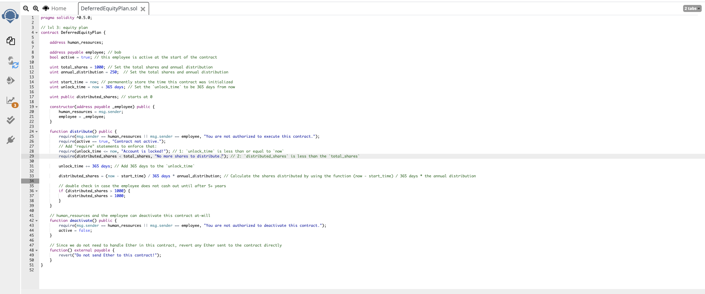
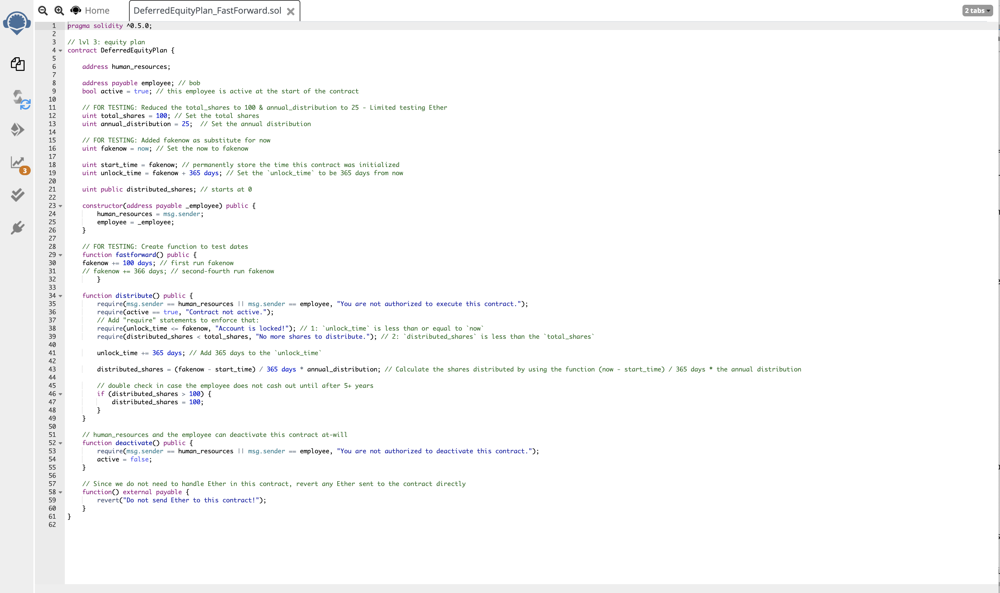

# Solidity Contracts

This homework assignment required we build 3 Ethereum-compatible blockchain contracts to distribute profit plans. We used the following 3 tools to build our solidity contracts: 

| | | |
|:---:|:---:|:---:|
| Ganache | MetaMask | Remix |

This assignment has 3 levels of difficulty, with each contract increasing in complexity and capability. I was able to sucessfully create and deploy 2 of the 3 contracts, however the third contract would not deploy under test conditions. In light of homework deadlines, I have included the attempt at deploying the third contract and the error message generated.

### Level One: The `AssociateProfitSplitter` Contract

The **`AssociateProfitSplitter`** will accept Ether into the contract and divide the Ether evenly among the associate level employees. This will allow the Human Resources department to pay employees quickly and efficiently.

After compiling the code, we deploy the contract with 0 wei, for which there is a fee charged to our Ether account.

Once the contract has been activated we will test the functionality by transferring 45 Ether into the employees' accounts.

You'll see that Ganache before and after, shows 45 Ether was taken from Account 1 and 15 Ether was deposited into each employee's account (Account 2, Account 3, and Account 4).

|||
|:---:|:---:|
| Account Value Pre-AssociateProfitSplitter | Account Value Post-AssociateProfitSplitter |

### Level Two: The `TieredProfitSplitter` Contract

The **`TieredProfitSplitter`** will distribute different percentages of incoming Ether to employees at different tiers/levels. For example, the CEO gets paid 60%, CTO 25%, and Bob gets 15%.

After compiling the code, we deploy the contract with 0 wei, for which there is a fee charged to our Ether account.

Once the contract has been activated we will test the functionality by transferring 99 Ether into the employees' accounts.

You'll see that Ganache before and after, shows 99 Ether was taken from Account 6 and Ether was deposited into each employee's account (59.40 to Account 2 (60%), 24.75 to Account 3 (25%), and 14.85 to Account 4 (15%)).

|||
|:---:|:---:|
| Account Value Pre-TieredProfitSplitter | Account Value Post-TieredProfitSplitter |

### Level Three: The `DeferredEquityPlan` Contract

**`DeferredEquityPlan`** models traditional company stock plans. This contract will automatically manage 1000 shares with an annual distribution of 250 over 4 years for a single employee.

Because this contract has a lock period, there was a **`DeferredEquityPlan_FastForward`** contract created to test the functionality of the contract based on false dates. Also, because of limited Ether in the test accounts, for test purposes, the 1000 total distribution shares was reduced to 100 and the 250 annual shares was reduced to 25.

After compiling the code, we deploy the contract with 0 wei, for which there is a fee charged to our Ether account.

Once the contract has been activated we will test the functionality by transferring 25 Ether into the employees' accounts.

This is where the error message occurred. After multiple attempts at correcting the code and recompiling and redeploying, the error message was not resolved.